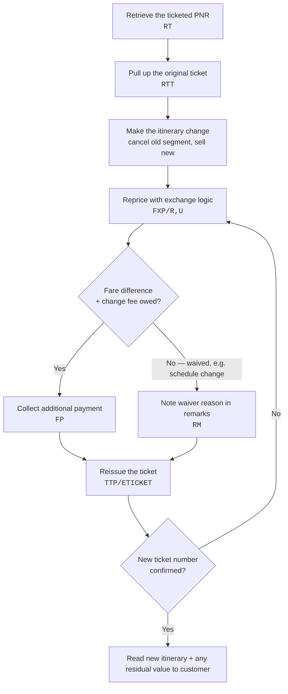
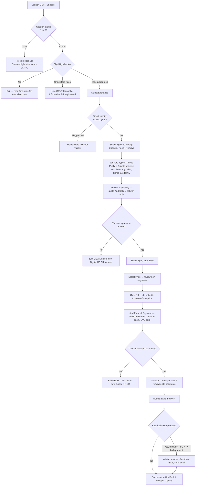
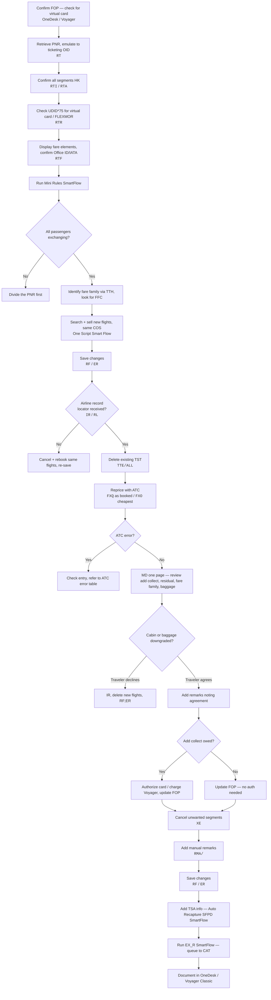

import FlapHeader from '@site/src/components/FlapHeader';
import CommandTable from '@site/src/components/CommandTable';

<FlapHeader eyebrow="Topic 04 · Post-ticketing change" text="Reissue & Exchange" icon="/img/topics/reissue-exchange.svg" />

**When to use this:** the customer already has a ticketed booking and wants to change a flight,
date, or routing. This covers both airline-initiated schedule changes and voluntary customer
changes, which usually carry a fare difference and/or change fee.

:::tip Draft content — verify before relying on it in production
Reissue rules are the most airline-specific part of this whole knowledge base — fare rules,
penalty amounts, and even the exact reissue command can differ by carrier and fare basis. Treat
the flow below as the general shape, and add airline-specific notes via a pull request if you
handle a carrier with unusual rules.
:::

## The flow

## Command reference

<CommandTable rows={[
  {
    command: 'RTT',
    purpose: 'Display the original ticket details linked to the current PNR before making changes.',
    example: 'RTT',
    commonErrors: 'NO TICKET ON FILE means the PNR may have been split, or the ticket was issued under a different record locator — search by ticket number instead.',
  },
  {
    command: 'XE1',
    purpose: 'Cancel segment 1 so a replacement segment can be sold in its place.',
    example: 'XE1',
    commonErrors: 'Cancelling the wrong segment number — always re-check the current segment list with RT immediately before XE.',
  },
  {
    command: 'FXP/R,U',
    purpose: 'Reprice the itinerary applying exchange (residual/upgrade) logic instead of a fresh fare.',
    example: 'FXP/R,U',
    commonErrors: 'INVALID FOR EXCHANGE appears when the original fare basis is non-changeable — check the fare rules before promising the customer a change is possible.',
  },
  {
    command: 'RM CHANGE FEE WAIVED SCHEDULE CHANGE',
    purpose: 'Free-text remark documenting why a fee was waived, for audit purposes.',
    example: 'RM CHANGE FEE WAIVED SCHEDULE CHANGE',
    commonErrors: 'Skipping this step is the most common reason a waiver gets questioned later — always document the reason at the time.',
  },
  {
    command: 'TTP/ETICKET',
    purpose: 'Reissue the ticket, replacing the original with the new itinerary and any collected difference.',
    example: 'TTP/ETICKET',
    commonErrors: 'FARE EXPIRED means the repriced fare quote timed out — rerun FXP/R,U immediately before reissuing.',
  },
]} />

## Exchange with Amadeus GEVR (ATC)

Use the GEVR Shopper script when the ticket is ATC-eligible — Amadeus prices and guarantees the
fare automatically, which is faster and lower-risk than a manual reprice.

:::tip Before you launch GEVR
1. Coupon status must be **Open (O)** or **Airport Control (A)**. If it's **Check-in (CKIN)**,
   go to *Flight | Change | Change flight with status CKIN or C* first to see if it can be
   reopened.
2. Run the **Eligibility checker**. "Yes" means changes are permitted and the fare is guaranteed —
   continue. "Check Fare rules" means the script can't determine eligibility — for Pre-travel/FTC
   use the GEVR **Manual** flow instead; for a partial ticket use **Informative Pricing** outside
   GEVR.
3. **SWA WGA (Basic) fares:** check mini rules first. For tickets issued on/after May 28, WGA
   change eligibility only covers Credit redemptions, not Voluntary Change.
:::

> **Screenshot placeholder:** the source material references a screenshot of the ticket-validity
> warning here (tickets past one-year validity shown in red). Add the image to `static/img/` and
> embed it with `` when available.

<CommandTable rows={[
  {
    command: 'Automatic Basic Refund — N/A here',
    purpose: 'Not used in this flow — listed for contrast only. GEVR ATC quotes from the Add Collect column, which is priced and guaranteed by Amadeus.',
    example: 'Add Collect column',
    commonErrors: 'If a Residual Value column also appears, note the amount internally but do not quote it to the traveler — it can\u2019t be confirmed yet whether it\u2019s an MCO/EMD or lost value.',
  },
  {
    command: 'RF<SSO login>;ER',
    purpose: 'Add remarks and save changes when exiting GEVR without completing the exchange (e.g. traveler declines, or a card fails with no alternative).',
    example: 'RFSMITHJ;ER',
    commonErrors: 'For Neutral Availability exits, you must also manually delete the newly added flights — Neutral Availability saves them, unlike ATC Shopper.',
  },
]} />

:::info Residual value — only quote if both fields are present
Check the remarks field for the EVR script\u2019s residual notes **and** display the FO line for a
`*RV` field. Both must be present for the residual to apply. If only one shows, don\u2019t quote a
residual to the traveler. When it does apply: no change fee to use it, it\u2019s non-transferable
(same passenger only), and — absent a specific fare-rule validity period — assume it must be
booked and used within 1 year of creation.
:::

## Exchange a flight outside GEVR (ATC) — infant fare family bookings

Use this manual ATC flow only when the booking has an infant traveler that needs fare family
qualifiers — GEVR doesn't handle this case.

<CommandTable rows={[
  {
    command: 'RTF',
    purpose: 'Display fare elements — confirm Office ID/IATA matches your current office before continuing.',
    example: 'RTF',
    commonErrors: 'If the Office ID/IATA doesn\u2019t match, you must log into the correct Office ID before proceeding — pricing will be wrong otherwise.',
  },
  {
    command: 'TWD/L[FA line]',
    purpose: 'Display the ticket image for a given FA line — check coupon status, validating carrier, COS, baggage allowance, tour code, ticket value, and the endorsement line for a Non-Changeable flag.',
    example: 'TWD/L5',
    commonErrors: 'A BEF (Basic Economy Fare) may trigger a SmartFlow warning for some airlines — treat it as a prompt to review restrictive-fare options before continuing.',
  },
  {
    command: 'TTH / TTH/T1',
    purpose: 'Display TST history to find the Fare Family Code (FFC). Use /T[n] to select a specific passenger\u2019s TST in a multi-passenger PNR.',
    example: 'TTH/T1',
    commonErrors: 'Reading the wrong passenger\u2019s TST in a multi-pax PNR leads to re-pricing in the wrong fare family.',
  },
  {
    command: 'TTE/ALL',
    purpose: 'Delete the existing TST before repricing with ATC.',
    example: 'TTE/ALL',
    commonErrors: 'Skipping this before FXQ/FXO can cause the new pricing to stack on the old quote instead of replacing it.',
  },
  {
    command: 'FXQ',
    purpose: 'ATC price as booked. This prices and stores the TST for all passengers in the PNR.',
    example: 'FXQ/R,U*BD/K/S1,3',
    commonErrors: 'If FXQ doesn\u2019t price, fall back to FXO (price as cheapest) with the same qualifiers.',
  },
  {
    command: 'FXO',
    purpose: 'ATC price as cheapest — use when FXQ does not return a fare.',
    example: 'FXO/R,U*BD/K/S1,3',
    commonErrors: 'May return a fare in a different cabin — always confirm cabin/baggage before quoting.',
  },
  {
    command: '/FF-[fare family] *[Corporate Code]',
    purpose: 'Add fare family and/or corporate code qualifiers to pricing (POS-dependent — e.g. RBC, CA Retail, WN).',
    example: 'FXP/R,U*EXPEDIA/FF-FLEX/S1-3',
    commonErrors: 'Applying a corporate code that\u2019s not on file for the POS returns a fare mismatch — verify the code against the original booking first.',
  },
  {
    command: 'FQD[city pair]/D[date]/C[COS]/A[airline]',
    purpose: 'Check the cabin of the new flights before confirming the exchange with the traveler.',
    example: 'FQDLONNYC/D15DEC/CY/AAA',
    commonErrors: 'Skipping this check is how an unnoticed cabin downgrade slips through to the traveler.',
  },
  {
    command: 'DECC[type][number]/[exp]/[currency][amount]/[VC]',
    purpose: 'Generate a credit card authorization for the add collect amount on a published fare.',
    example: 'DECCVI4444330322221117/0224/USD1090.00/UA',
    commonErrors: 'If no authorization is generated, get a new card from the traveler rather than retrying the same card repeatedly.',
  },
  {
    command: 'FPO/CC[type]+/CC[new type][number]/[exp]/N[auth]',
    purpose: 'Update the form of payment in the PNR with the new authorization code (add FPINFO for infants).',
    example: 'FPO/CCVI+/CCVI4321123456789123/0324/N123456',
    commonErrors: 'Forgetting the FPINFO line for infants leaves the infant segment\u2019s FOP unresolved.',
  },
  {
    command: 'XE[segment numbers]',
    purpose: 'Cancel the unwanted (old) flight segments once the new ones are confirmed.',
    example: 'XE2,4',
    commonErrors: 'Re-check segment numbers with a fresh RT immediately before this — they shift after every sell/cancel.',
  },
  {
    command: 'RMA/[free text]',
    purpose: 'Add a manual remark documenting the authorization code and any residual credit info given to the traveler.',
    example: 'RMA/AUTH 123456 RESIDUAL USD45.00 ADVISED',
    commonErrors: 'Leaving out the auth code or residual note makes the transaction hard to audit later.',
  },
  {
    command: 'EX_R',
    purpose: 'SmartFlow that documents and queue-places the PNR to CAT, entering ATC as the process type. Triggers the new-itinerary confirmation email.',
    example: 'EX_R',
    commonErrors: 'Running this before the FOP and remarks are fully updated queues an incomplete record to CAT.',
  },
]} />

:::note RBC fee reminder
For RBC bookings, remember to charge the RBC fee in Voyager. If you can\u2019t charge it, add notes
for the Back Office team and queue the PNR to them using the exchange SmartFlow.
:::

## Related topics

- [Fare & Pricing](/fare-and-pricing) — the qualifiers (`/R,UP`, `/FF-`, `/K`, `/S`) used in ATC repricing above.
- [Ticketing](/ticketing) — the original issuance flow this builds on.
- [Refunds](/refunds) — for when the customer wants to cancel rather than change.
- [Error Codes & Troubleshooting](/error-codes) — exchange-specific rejection messages.
